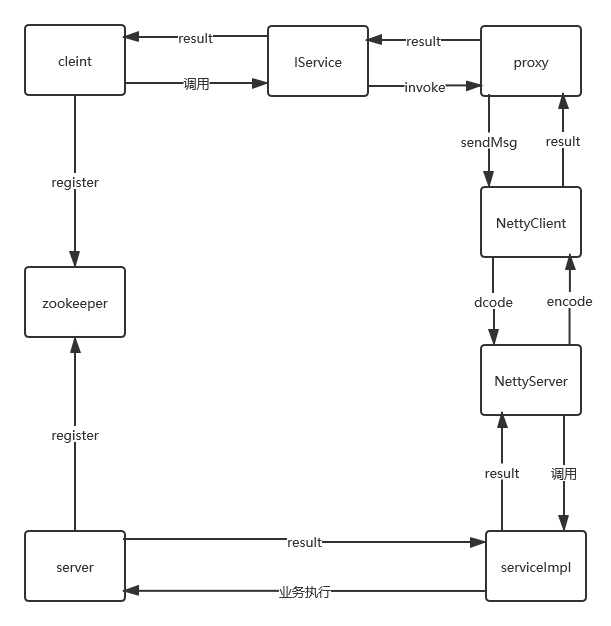

## SpringBoot + Netty + Zookeeper实现RPC

***

### 1.**使用框架**

- **Springboot** ⟹  2.0.5.RELEASE
- **zookeeper**   ⟹   3.4.0
- **curator-framework** ⟹  4.0.1
- **curator-recipes** ⟹ 4.0.1
- **netty** ⟹  4.1.38.Final

### 2.**整体流程**



### 3.**协议设计**

| 字段       | 解释                         | 长度  |
| ---------- | ---------------------------- | ----- |
|            |                              |       |
| serializer | 序列化方式                   | 1Byte |
| type  | 请求类型（心跳或者业务请求）    | 1Byte |
| requestId  | 请求id                     | 32Byte |
| dataLength | body字节长度                 | 4Byte |
| body       | 消息体                       | dataLength 个Byte |

### 4.**代码结构**

- **client**

  客户端包：主要用于服务消费者引入，用于创建接口代理，建立与服务端的长连接，发送请求给服务提供者。

- **server**

  服务端包：用于服务提供者引入，暴露服务，启动netty服务监听指定端口，接收请求。

- **common**

  client和common共同引入的代码，工具类，自定义协议，配置类

- **serialization**

  序列化器：目前支持jackson和kyro（后续会添加pb）

- **annotation**

  存放注解(用于标识扫描的接口和实现类)

### 5. **调用示例**

   1. #### 新建API公共接口模块

      - 新建普通maven应用，引入**annotation**

      ```java
      <dependency>
          <groupId>org.zcj.rpc</groupId>
          <artifactId>annotation</artifactId>
          <version>1.0-SNAPSHOT</version>
      </dependency>
      ```

      - 编写一个接口

      ​		注解指定接口版本，序列化器0:json  1:kyro

      ```java
      @RpcProxy(version = "1.0", serializer = (byte)1)
      public interface HelloService {
      
          String hello(String hi);
      
      }
      ```

   2. #### 新建producer生产者应用

      -  新建springboot应用

      - 引入第一步创建的API jar

      ```java
      <dependency>
          <groupId>org.zcj.rpc</groupId>
          <artifactId>api</artifactId>
          <version>1.0-SNAPSHOT</version>
      </dependency>
      ```

      -  引入server jar

      ```java
      <dependency>
          <groupId>org.zcj.rpc</groupId>
          <artifactId>server</artifactId>
          <version>1.0-SNAPSHOT</version>
      </dependency>
      ```

      -  实现API定义好的接口

      ```
      @RpcService(value = HelloService.class, version = "1.0")
      public class HelloServiceImpl implements HelloService {
      
          @Override
          public String hello(String hi) {
              return "hello welcome !!!";
          }
      }
      ```

   3. #### 新建customer消费者应用

         - 新建springboot项目

         - 引人API jar

         ```java
         <dependency>
             <groupId>org.zcj.rpc</groupId>
             <artifactId>api</artifactId>
             <version>1.0-SNAPSHOT</version>
         </dependency>
         ```

         - 引入client jar

         ```java
         <dependency>
             <groupId>org.zcj.rpc</groupId>
             <artifactId>client</artifactId>
             <version>1.0-SNAPSHOT</version>
         </dependency>
         ```

         - 编写一个RestController方便测试

         ```java
         @RestController
         public class HelloController {
         
         	// 注入API模块定义好的接口
             @Autowired
             HelloService helloService;
         
             @RequestMapping("/hello")
             public String hello() {
                 return helloService.hello("hello");
             }
         
         }
         ```

​        

   4. #### 启动项目

      - 启动ZK，启动服务提供者Producer，启动服务消费者Customer

      - 访问服务消费者

      

      ​	可以看到防范服务消费，已经成功的跨进程调用了服务提供者返回了 hello welcome !!!字符串。

      


  

  

  

  


